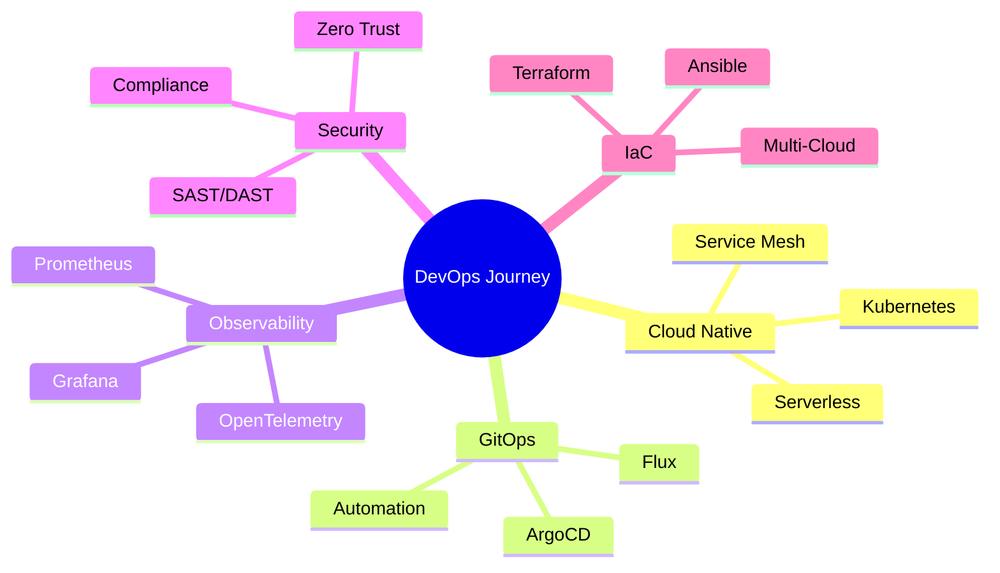

#  Hey there, I'm Himanshu Solanki

<div align="center">
  
[](https://git.io/typing-svg)

</div>

<div align="center">
  
[](https://www.linkedin.com/in/himanshu-solanki81815/)
[](https://h8815.medium.com/)
[](https://www.instagram.com/h8_815/)
[](#)
[](mailto:your.email@example.com)

</div>

---

## 🎯 **About Me**

```yaml
name: Himanshu Solanki
role: DevOps Engineer
location: India 🇮🇳
current_focus: 
  - Kubernetes orchestration
  - GitOps workflows with ArgoCD
  - Multi-cloud infrastructure automation
  - Observability & monitoring
philosophy: "Automate everything, monitor everything, improve everything"
coffee_consumed: ∞
```

### 🌟 **What I Do**

- 🏗️ Design and implement **scalable cloud infrastructure** on AWS
- 🔄 Build **CI/CD pipelines** that developers love using
- 🐳 Containerize applications and orchestrate them with **Kubernetes**
- 📊 Create comprehensive **monitoring & alerting** systems
- 🛡️ Implement **security best practices** across the entire DevOps lifecycle
- 📝 Write technical blogs sharing my learnings on [Medium](https://h8815.medium.com/)
- 🎓 Mentor aspiring DevOps engineers and contribute to open source

---

## 🛠️ **Tech Arsenal**

<details open>
<summary><b>☁️ Cloud Platforms</b></summary>
<br>


</details>

<details open>
<summary><b>🐳 Container & Orchestration</b></summary>
<br>


</details>

<details open>
<summary><b>🔄 CI/CD & GitOps</b></summary>
<br>


</details>

<details open>
<summary><b>⚙️ Infrastructure as Code</b></summary>
<br>


</details>

<details open>
<summary><b>📊 Monitoring & Observability</b></summary>
<br>


</details>

<details open>
<summary><b>💻 Programming & Scripting</b></summary>
<br>


</details>

<details open>
<summary><b>🗄️ Databases & Caching</b></summary>
<br>


</details>

<details open>
<summary><b>🔐 Security & Compliance</b></summary>
<br>


</details>

<details open>
<summary><b>🛠️ Tools & Platforms</b></summary>
<br>


</details>

---

## 📈 **GitHub Analytics**

<div align="center">
  


</div>

<div align="center">
  


</div>

---

## 🏆 **Achievements & Trophies**

<div align="center">
  


</div>

---

## 📊 **Contribution Activity**

<div align="center">
  


</div>

---

## 🚀 **Featured Projects**

<div align="center">

<a href="https://github.com/h8815/project1">
  
</a>
<a href="https://github.com/h8815/project2">
  
</a>

</div>

---

## 💡 **Current Focus Areas**



---

## 📚 **Latest Blog Posts**

<!-- BLOG-POST-LIST:START -->
- 🚀 [Mastering Kubernetes: From Zero to Production](https://h8815.medium.com/)
- ⚙️ [Building Scalable CI/CD Pipelines with Jenkins & ArgoCD](https://h8815.medium.com/)
- ☁️ [AWS Infrastructure Automation with Terraform](https://h8815.medium.com/)
- 📊 [Complete Guide to Prometheus & Grafana](https://h8815.medium.com/)
<!-- BLOG-POST-LIST:END -->

➡️ [Read more on Medium](https://h8815.medium.com/)

---

## 💭 **DevOps Wisdom**

<div align="center">


</div>

---

## 🎓 **Certifications & Learning**

<div align="center">

| Certification | Provider | Status |
|--------------|----------|--------|
| AWS Solutions Architect | Amazon | 🎯 In Progress |
| Certified Kubernetes Administrator (CKA) | CNCF | 🎯 In Progress |
| HashiCorp Terraform Associate | HashiCorp | ✅ Planning |
| Docker Certified Associate | Docker | ✅ Planning |

</div>

---

## 📫 **Let's Connect!**

<div align="center">

💬 **Open to collaborations, consulting, and interesting DevOps conversations!**

[](https://www.linkedin.com/in/himanshu-solanki81815/)
[](https://h8815.medium.com/)
[](mailto:your.email@example.com)

</div>

---

## 🌟 **Fun Facts**

- ⚡ I can debug production issues faster with coffee than without it
- 🎮 When not automating infrastructure, I'm probably gaming or exploring new tech
- 🏔️ Dream project: Building a fully automated smart home with Kubernetes
- 📖 Currently reading: "The Phoenix Project" (again!)
- 🎵 Coding soundtrack: Lo-fi beats and synthwave

---

## 🐍 **Contribution Snake**

<div align="center">
  


</div>

---

<div align="center">
  
### **💻 Profile Views Counter**


---

### **⭐️ Star My Repositories if You Find Them Useful!**

[](https://github.com/h8815)
[](https://github.com/h8815)

---

**"The best infrastructure is invisible infrastructure."** ✨

</div>
